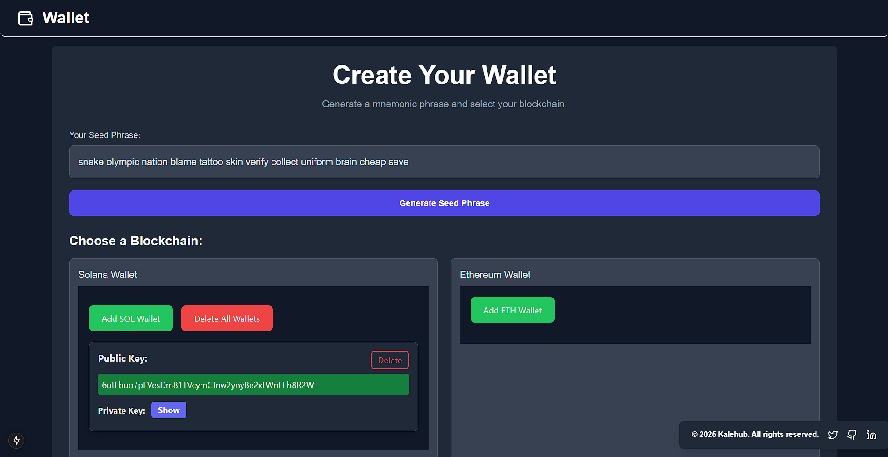

# Week 3 Assignment: Wallet Generator 🔐

This project is part of the Web3 Cohort Week 3 assignment (planning on expanding it to more), where I built a **Wallet Generator** for both **Ethereum** and **Solana** networks. The app generates wallets based on a mnemonic phrase and displays both public and private keys.

---

## 🚀 Features

### **Ethereum Wallet**:
- **Generate a wallet address (public key)**.
- **Generate the private key** and the corresponding mnemonic phrase for Ethereum wallets.
- Secure handling of wallet keys (private key can be toggled to show/hide).

### **Solana Wallet**:
- **Generate a wallet address (public key)** for Solana.
- **Generate the private key** and mnemonic phrase for Solana wallets.

---

## 💻 Tech Stack

- **Frontend**: 
  - **Nextjs** with **TypeScript** for building the user interface.
  - **Tailwind CSS** for responsive and efficient styling.

- **Blockchain**:
  - **Ethers.js** for interacting with the Ethereum network and generating Ethereum wallets.
  - **Solana Web3.js** and **Bip39** for Solana wallet generation and key management.

---

## 📚 Learning Goals

- Understanding how mnemonics can be used to generate keys for multiple blockchain networks.
- Gaining hands-on experience with Ethereum and Solana wallet management.
- Exploring key concepts in Web3 and wallet security.
